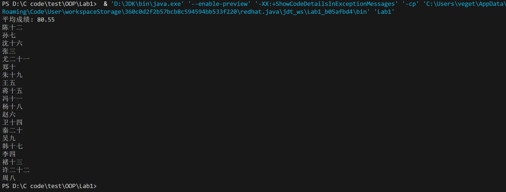
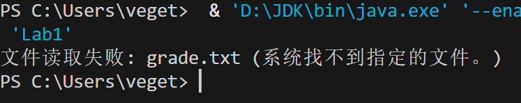

# Lab1——学生成绩排名系统
## 1. 概述
本项目使用 Java 读取学生成绩文件，计算平均成绩，并按照成绩排序后输出。

## 2. Java代码
```java
import java.io.*;
import java.util.*;

public class Lab1 {
    public static void main(String[] args) {
        List<Student> students = new ArrayList<>();
        String fileName = "grade.txt";

        // 使用 try-with-resources 语句自动关闭资源
        try (BufferedReader br = new BufferedReader(new InputStreamReader(new FileInputStream(fileName), "UTF-8"))) {
            String line;
            while ((line = br.readLine()) != null) {
                String[] parts = line.split("\\s+"); // 使用正则表达式处理多个空格
                if (parts.length == 2) {
                    try {
                        int score = Integer.parseInt(parts[1]);
                        students.add(new Student(parts[0], score));
                    } catch (NumberFormatException e) {
                        System.err.println("无效的成绩格式: " + parts[1]);
                    }
                } else {
                    System.err.println("无效的行格式: " + line);
                }
            }
        } catch (IOException e) {
            System.err.println("文件读取失败: " + e.getMessage());
            return;
        }

        // 计算平均成绩
        double average = students.stream()
                .mapToInt(Student::getScore)
                .average()
                .orElse(0.0);
        System.out.println("平均成绩: " + average);

        // 按成绩从高到低排序
        students.sort(Comparator.comparingInt(Student::getScore).reversed());

        // 输出学生姓名
        students.forEach(student -> System.out.println(student.getName()));
    }
}

class Student {
    private String name;
    private int score;

    Student(String name, int score) {
        this.name = name;
        this.score = score;
    }

    public String getName() {
        return name;
    }

    public int getScore() {
        return score;
    }
}
```

## 3. 说明
### 3.1 功能
1. **读取文件** `grade.txt`，解析学生姓名和成绩。
2. **计算并输出平均成绩**。
3. **按成绩降序排序**，输出学生姓名。

### 3.2 输入示例 (文件`grade.txt`)
```
张三 90
李四 70
王五 85
赵六 78
孙七 92
周八 66
吴九 74
郑十 88
冯十一 81
陈十二 95
褚十三 69
卫十四 77
蒋十五 83
沈十六 91
韩十七 72
杨十八 80
朱十九 87
秦二十 76
尤二十一 89
许二十二 68
```

### 3.3 输出示例
```
平均成绩: 80.55
陈十二
孙七
沈十六
张三
尤二十一
郑十
朱十九
王五
蒋十五
冯十一
杨十八
赵六
卫十四
秦二十
吴九
韩十七
李四
褚十三
许二十二
周八
```

## 4. 运行结果截图


## 5.问题及解决方案
### 系统找不到文件


**解决方案：将文件grade.txt与代码放在同一个文件夹中，打开整个文件夹进行操作**

