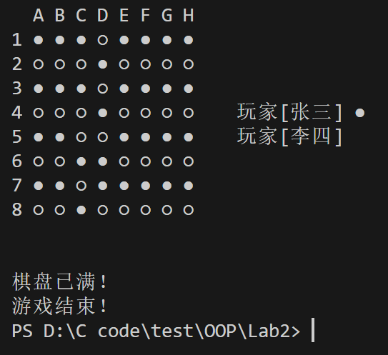
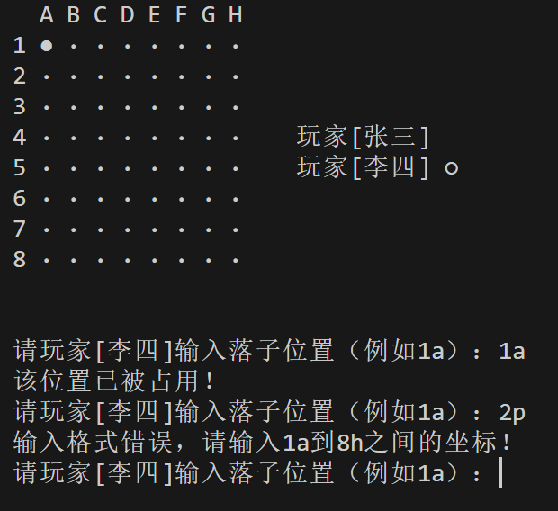

# OOP Lab2 黑白棋 Report
23307110043 孙天宇

## 一、功能实现
### 1. 核心功能
- **棋盘初始化**：8x8棋盘，初始状态全为空（`·`）
- **玩家信息显示**：右侧动态标注当前玩家（`●` 或 `○`）
- **输入验证**：支持格式 `1a` 到 `8h`，或 `1A` 到  `8H` ，自动过滤非法输入
- **棋盘已满检测**：所有位置非空时终止游戏
- **清屏功能**：每次落子后刷新控制台界面

### 2. 输入错误处理
- **格式错误提示**：`输入格式错误，请输入1a到8h之间的坐标！`
- **位置占用提示**：`该位置已被占用！`

---

## 二、代码结构
### 1. 文件清单
| 文件名           | 功能描述                     |
|------------------|----------------------------|
| `ReversiGame.java` | 主类，包含棋盘、玩家、游戏逻辑 |

### 2. 类说明
- **`Board` 类**  
  - 管理棋盘状态（`Piece[][]`）
  - 提供打印棋盘（`printBoard`）和落子方法（`placePiece`）
  - 检测棋盘是否已满（`isFull`）
  
- **`Player` 类**  
  - 封装玩家名称和棋子类型（黑棋 `BLACK` / 白棋 `WHITE`）

- **`Game` 类**  
  - 控制游戏流程（`start` 方法）
  - 处理用户输入及清屏逻辑（`clearScreen`）

---

## 四、关键代码说明
### 1. 棋盘类
```java
public static class Board {
    // 定义棋子枚举类型
    public enum Piece { EMPTY, BLACK, WHITE }
    private Piece[][] board = new Piece[8][8];  // 8x8的棋盘

    // 构造函数，初始化棋盘，所有位置为空
    public Board() {
        for (int i = 0; i < 8; i++) 
            for (int j = 0; j < 8; j++) 
                board[i][j] = Piece.EMPTY;
    }

    // 打印棋盘，并显示当前玩家信息
    public void printBoard(Player currentPlayer, Player player1, Player player2) {
        ystem.out.println("  A B C D E F G H");  // 打印列标号
        for (int i = 0; i < 8; i++) {
            System.out.print((i+1) + " ");  // 打印行号
                for (int j = 0; j < 8; j++) {
                // 根据棋子的类型选择对应的符号
                String symbol = switch(board[i][j]) {
                    case BLACK -> "●";
                    case WHITE -> "○";
                    case EMPTY -> "·";
                };
                System.out.print(symbol + " ");  // 打印棋子
            }
                
            System.out.print("   ");
            // 在棋盘右侧显示当前玩家信息
            if (i == 3) {
                String mark = (currentPlayer == player1) ? "●" : " ";
                System.out.printf("玩家[%s] %s", player1.getName(), mark);
            } else if (i == 4) {
                String mark = (currentPlayer == player2) ? "○" : " ";
                System.out.printf("玩家[%s] %s", player2.getName(), mark);
            }
            System.out.println();
        }
        System.out.println("\n");
    }
        // 定义检测棋盘已满的函数
        public boolean isFull() {
        for (int i = 0; i < 8; i++) {
            for (int j = 0; j < 8; j++) {
                if (board[i][j] == Piece.EMPTY) {  // 依次检测每个位置是否为空
                    return false;   // 有位置为空则棋盘未满
                }
            }
        }
        return true;
    }
        // 定义放置棋子的函数
        public boolean placePiece(int row, int col, Piece piece) {
            if (row < 0 || row >=8 || col <0 || col >=8) return false;  // 检查位置是否合法
            if (board[row][col] != Piece.EMPTY) return false;  // 检查位置是否为空
            board[row][col] = piece;  // 放置棋子
            return true;
        }
    }
```
### 2. 玩家类
```java
public static class Player {
    private final String name;  // 玩家姓名
    private final Board.Piece piece;  // 玩家使用的棋子类型

    public Player(String name, Board.Piece piece) {
        this.name = name;
        this.piece = piece;
    }
    public String getName() { return name; }
    public Board.Piece getPiece() { return piece; }
}
```
### 3. 游戏类
```java
public static class Game {
    private final Board board = new Board();  // 游戏棋盘
    private final Player player1;  // 玩家1
    private final Player player2;  // 玩家2
    private Player currentPlayer;  // 当前玩家

    // 构造函数，初始化玩家和棋盘
    public Game(String p1, String p2) {
        player1 = new Player(p1, Board.Piece.BLACK);
        player2 = new Player(p2, Board.Piece.WHITE);
        currentPlayer = player1;
    }

    // 开始游戏
    public void start() {
        Scanner scanner = new Scanner(System.in);
        while (true) {
            clearScreen();  // 清屏
            board.printBoard(currentPlayer, player1, player2);  // 打印棋盘
                
            if (board.isFull()) {  // 检查棋盘是否已满
                System.out.println("棋盘已满！");
                System.out.println("游戏结束！");
                break;
            }
                
            while (true) {
                // 提示当前玩家输入落子位置
                System.out.print("请玩家[" + currentPlayer.getName() + "]输入落子位置（例如1a）：");
                String input = scanner.nextLine().trim();
        
                if (input.equalsIgnoreCase("exit")) {  // 如果输入exit，退出游戏
                    scanner.close();
                    return;
                }
        
                if (!input.matches("[1-8][a-hA-H]")) {  // 检查输入格式是否正确
                    System.out.println("输入格式错误，请输入1a到8h之间的坐标！");
                    continue;
                }
        
                // 解析输入的坐标
                int row = Integer.parseInt(input.substring(0, 1)) - 1;
                int col = input.toLowerCase().charAt(1) - 'a';
        
                if (!board.placePiece(row, col, currentPlayer.getPiece())) {  // 尝试放置棋子，检查是否会出现棋子重叠
                    System.out.println("该位置已被占用！");
                        continue;
                }
        
                currentPlayer = (currentPlayer == player1) ? player2 : player1;  // 用户输入完毕后切换玩家
                    break;
            }
        }
        scanner.close();
    }
}
```
### 4. 清屏
```java
public static void clearScreen() {
    try {
        new ProcessBuilder("cmd", "/c", "cls").inheritIO().start().waitFor();  // 使用cmd命令清屏
    } catch (Exception e) {
        System.out.println("\n\n\n\n\n\n\n\n\n\n");  // 如果清屏失败，打印多个空行分隔
    }
}
```
### 5. 主函数
```java
public static void main(String[] args) {
    new Game("张三", "李四").start();
}
```

---
## 五、运行结果示例
### 1. 棋盘填满后，返回游戏结束的提示：



### 2. 用户输入不符合要求，返回报错信息：


