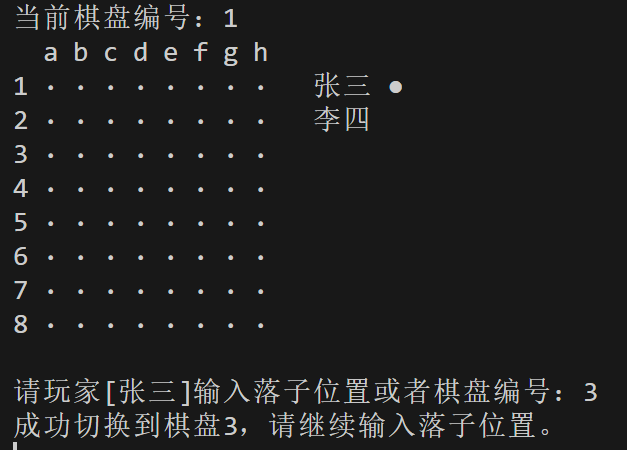

# Lab3 多棋盘黑白棋游戏
23307110043 孙天宇

#### 在Lab2的基础上增加多棋盘管理与切换棋盘的功能
#### 用户可以选择输入下棋位置或棋盘编号

---

## 类与功能说明
### 1. `Board.java`
功能：管理单个棋盘的状态及显示。

`placePiece(int row, int col, Piece piece)`：在指定位置放置棋子。

`display(...)`：显示棋盘状态，包含当前棋盘编号、玩家名称及回合标识。

`isFull()`：检查棋盘是否已满。

### 2. `Game.java`
功能：控制游戏流程，管理三个棋盘的切换与回合逻辑。

使用`boardTurns`数组记录每个棋盘的当前玩家（0为玩家1，1为玩家2）。

输入1-3切换棋盘，输入坐标（如1a）落子。

游戏结束条件：所有棋盘均被填满。

### 3. `Piece.java`
枚举类型：定义棋子类型：

`BLACK("●")`

`WHITE("○")`

`EMPTY("·")`

### 4. `Player.java`
功能：存储玩家信息，包括名称和使用的棋子类型。

### 5. `Reversegame.java`
主类：初始化玩家并启动游戏。
<br>

## 游戏规则与操作说明
- **棋盘切换**：输入1、2或3切换到对应棋盘。

- **落子操作**：输入格式为行号+列字母（如1a表示第1行a列）。

- **回合逻辑**：每个棋盘的回合独立，落子后自动切换当前玩家。

- **胜利条件**：无胜负判定，游戏在所有棋盘填满时结束。

## 运行示例
- 切换棋盘


此后按任意键即切换到棋盘3

- 其他功能如落子、检查棋盘已满、输入格式检测等同lab2
<br>


## 部分代码解释
- `board` 类

新增棋盘编号
```java
public void display(Player player1, Player player2, Player currentPlayer, int boardNumber) {
        clearScreen();
        System.out.println("当前棋盘编号：" + boardNumber);  // 显示当前棋盘编号
        System.out.print("  ");
        for (char c = 'a'; c < 'a' + SIZE; c++) {
            System.out.print(c + " ");
        }
        System.out.println();
        for (int row = 0; row < SIZE; row++) {
            System.out.print((row + 1) + " ");
            for (int col = 0; col < SIZE; col++) {
                System.out.print(grid[row][col].getSymbol() + " ");
            }
            // 在前两行显示玩家姓名，并在轮到该玩家时显示其棋子标识
            if (row == 0) {
                System.out.print("  " + player1.getName());
                if (currentPlayer == player1) {
                    System.out.print(" " + player1.getPieceType().getSymbol());
                }
            } else if (row == 1) {
                System.out.print("  " + player2.getName());
                if (currentPlayer == player2) {
                    System.out.print(" " + player2.getPieceType().getSymbol());
                }
            }
            System.out.println();
        }
        System.out.println();
    }
```
- `game`类

新增通过字符串长度判断用户输入是棋盘编号或落子位置
```java
if (input.length() == 1) {
    // 单个字符输入：视为棋盘编号
    char ch = input.charAt(0);
    if (Character.isDigit(ch)) {
        int boardNumber = Character.getNumericValue(ch);
        if (boardNumber < 1 || boardNumber > 3) {
            System.out.println("棋盘编号必须在1到3之间！");
            scanner.nextLine();
        } else {
            currentBoardIndex = boardNumber - 1;
            System.out.println("成功切换到棋盘" + boardNumber + "，请继续输入落子位置。");
            scanner.nextLine();
        }
    } else {
        System.out.println("输入格式错误，请输入棋盘编号（1~3）或落子位置（例如：1a）！");
        scanner.nextLine();
    }
    // 切换棋盘不消耗回合，直接继续循环
    continue;
} else if (input.length() == 2) {
    // 输入长度为2时，视为落子位置，例如 "1a"
    boolean validMove = false;
    try {
        int row = Character.getNumericValue(input.charAt(0)) - 1;
        char colChar = Character.toLowerCase(input.charAt(1));
        int col = colChar - 'a';
        validMove = boards[currentBoardIndex].placePiece(row, col, currentPlayer.getPieceType());
        if (!validMove) {
            System.out.println("落子位置有误或该位置已被占用，请重新输入！");
            scanner.nextLine();
            continue;
        }
    } catch (Exception e) {
        System.out.println("输入格式有误，请使用如 '1a' 的格式！");
        scanner.nextLine();
        continue;
    }
    // 修改：仅更新当前棋盘的回合，不影响其他棋盘
    boardTurns[currentBoardIndex] = (boardTurns[currentBoardIndex] + 1) % 2;
} else {
    System.out.println("输入格式错误，请输入棋盘编号（1~3）或落子位置（例如：1a）！");
    scanner.nextLine();
    continue;
    }
```
