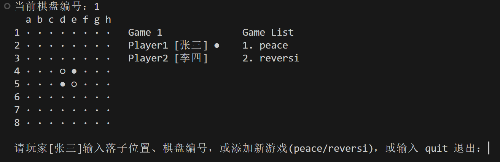
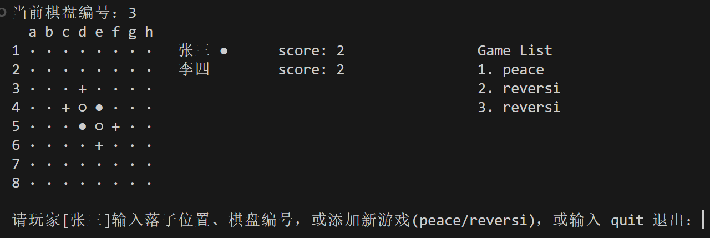
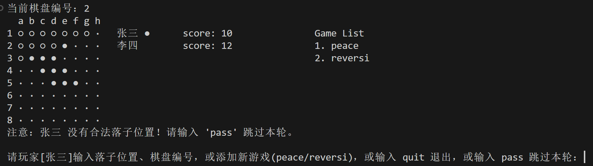
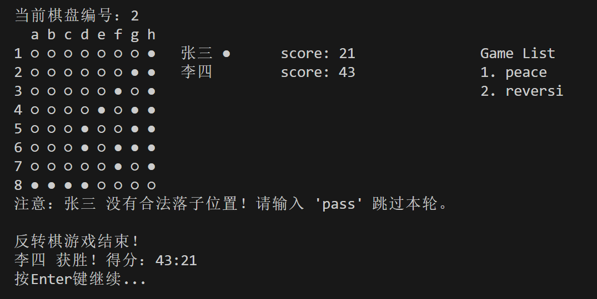
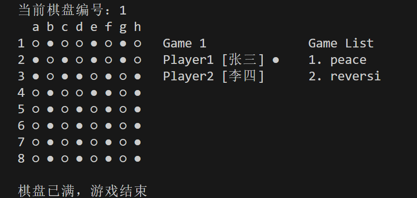

# Lab4 Reversegame 
23307110043 孙天宇

## Lab4概述
1. lab2、lab3中实现的游戏模式称为和平游戏（peace）。本次lab4需要增加新的游戏模式（reversi），需要实现完整的⿊⽩棋游戏，具体规则详⻅lab2⽂档。相较于peace模式的打印内容，reversi模式需要进⼀步显⽰每个玩家的得分，即棋盘上属于该玩家⼀⽅的剩余棋⼦数量。要求在棋盘上显⽰当前玩家的所有合法落⼦位置（⽤+表⽰）。
2. 保持lab3中同时维护多局游戏的逻辑。本次lab4要求初始存在2局游戏，第⼀局为peace模式，第⼆局为reversi模式。
3. 在现有打印内容的基础上，本次lab4需要在最右侧额外打印正在运⾏的游戏列表，包括游戏编号和游戏类型。
4. 本次lab4⽀持添加新的游戏：输⼊peace/reversi，在游戏列表的末尾添加新游戏。

## 代码结构解析(按照类)

### 1. `Piece.java`
定义了游戏中的棋子类型枚举：

```java
public enum Piece {
    BLACK("●"), WHITE("○"), EMPTY("·");
    private final String symbol;
    Piece(String symbol) { this.symbol = symbol; }
    public String getSymbol() { return symbol; }
}
```

- 创建了三种棋子状态：黑棋(●)、白棋(○)和空位(·)
- 每种状态关联一个字符串表示其显示符号
- 提供`getSymbol()`方法获取显示符号

### 2. `Player.java`
玩家类，存储玩家信息：

```java
public class Player {
    private final String name; // 玩家姓名
    private final Piece pieceType; // 玩家使用的棋子类型
    private int score = 2; // 玩家得分

    // 构造函数，初始化玩家姓名和棋子类型
    public Player(String name, Piece pieceType) {
        this.name = name;
        this.pieceType = pieceType;
    }

    // 获取玩家姓名
    public String getName() { 
        return name; 
    }

    // 获取玩家的棋子类型
    public Piece getPieceType() { 
        return pieceType; 
    }

    // 获取玩家得分
    public int getScore() {
        return score;
    }

    // 设置玩家得分
    public void setScore(int score) {
        this.score = score;
    }
}
```

- 存储玩家姓名和棋子类型（黑/白）
- 所有字段设为`final`，确保创建后不可更改
- 提供getter方法但没有setter，体现了不可变设计

### 3. `Board.java`
棋盘类，负责维护和显示8×8的棋盘：

```java
public class Board {
    private final int SIZE = 8;
    private final Piece[][] grid;
    
    // 初始化一个空棋盘
    public Board() {
        grid = new Piece[SIZE][SIZE];
        initializeBoard();
    }
    
    // 将所有位置设置为EMPTY
    private void initializeBoard() {
        for (int row = 0; row < SIZE; row++) {
            for (int col = 0; col < SIZE; col++) {
                grid[row][col] = Piece.EMPTY;
            }
        }
    }
    
    // 尝试放置棋子，成功返回true
    public boolean placePiece(int row, int col, Piece piece) {
        if (isValidPosition(row, col) && grid[row][col] == Piece.EMPTY) {
            grid[row][col] = piece;
            return true;
        }
        return false;
    }
    
    // 验证位置是否在棋盘范围内
    private boolean isValidPosition(int row, int col) {
        return row >= 0 && row < SIZE && col >= 0 && col < SIZE;
    }
    
    // 检查棋盘是否已满
    public boolean isFull() {
        for (Piece[] row : grid) {
            for (Piece cell : row) {
                if (cell == Piece.EMPTY) return false;
            }
        }
        return true;
    }
    
    // 显示棋盘状态，包含棋盘编号和当前玩家提示
    public void display(Player player1, Player player2, Player currentPlayer, int boardNumber) {
        clearScreen();
        System.out.println("当前棋盘编号：" + boardNumber);
        // 显示列标识(a-h)
        System.out.print("  ");
        for (char c = 'a'; c < 'a' + SIZE; c++) {
            System.out.print(c + " ");
        }
        System.out.println();
        
        // 显示棋盘内容和行号
        for (int row = 0; row < SIZE; row++) {
            System.out.print((row + 1) + " ");
            for (int col = 0; col < SIZE; col++) {
                System.out.print(grid[row][col].getSymbol() + " ");
            }
            
            // 在前两行显示玩家姓名和当前玩家的棋子标识
            if (row == 0) {
                System.out.print("  " + player1.getName());
                if (currentPlayer == player1) {
                    System.out.print(" " + player1.getPieceType().getSymbol());
                }
            } else if (row == 1) {
                System.out.print("  " + player2.getName());
                if (currentPlayer == player2) {
                    System.out.print(" " + player2.getPieceType().getSymbol());
                }
            }
            System.out.println();
        }
        System.out.println();
    }
    
    // 清屏方法（Windows系统）
    private void clearScreen() {
        try {
            new ProcessBuilder("cmd", "/c", "cls").inheritIO().start().waitFor();
        } catch (InterruptedException | IOException e) {
            e.printStackTrace();
        }
    }
}
```

- 使用二维数组`grid`表示8×8棋盘
- `initializeBoard()`初始化所有格子为空
- `placePiece()`在指定位置放置棋子，包含合法性检查
- `isFull()`检查棋盘是否已满（游戏结束条件）
- `display()`方法显示棋盘状态，包括：
  - 当前棋盘编号
  - 行列标识
  - 玩家信息和当前玩家标识
- `clearScreen()`用于清屏，提升用户体验

### 4. `Game.java`
游戏管理类，处理游戏流程和玩家交互：

```java
public class Game {
    // 维护三个棋盘
    private final Board[] boards = new Board[3];
    // 当前使用的棋盘索引
    private int currentBoardIndex = 0;
    private final Player player1;
    private final Player player2;
    // 每个棋盘独立的回合管理：0表示player1，1表示player2
    private final int[] boardTurns = new int[3];
    private final Scanner scanner;

    // 初始化三个棋盘和玩家
    public Game(Player player1, Player player2) {
        for (int i = 0; i < boards.length; i++) {
            boards[i] = new Board();
            boardTurns[i] = 0; // 每个棋盘初始由player1落子
        }
        this.player1 = player1;
        this.player2 = player2;
        this.scanner = new Scanner(System.in);
    }

    // 启动游戏并处理主循环
    public void start() {
        // 游戏循环，直到所有棋盘均已满
        while (!allBoardsFull()) {
            Board currentBoard = boards[currentBoardIndex];
            // 根据当前棋盘的回合索引确定当前玩家
            Player currentPlayer = (boardTurns[currentBoardIndex] == 0) ? player1 : player2;
            
            // 显示当前棋盘状态
            currentBoard.display(player1, player2, currentPlayer, currentBoardIndex + 1);
            System.out.print("请玩家[" + currentPlayer.getName() + "]输入落子位置或者棋盘编号：");
            String input = scanner.nextLine().trim();

            // 处理输入：单字符视为棋盘编号
            if (input.length() == 1) {
                char ch = input.charAt(0);
                if (Character.isDigit(ch)) {
                    int boardNumber = Character.getNumericValue(ch);
                    if (boardNumber < 1 || boardNumber > 3) {
                        System.out.println("棋盘编号必须在1到3之间！");
                    } else {
                        currentBoardIndex = boardNumber - 1;
                        System.out.println("成功切换到棋盘" + boardNumber + "，请继续输入落子位置。");
                    }
                } else {
                    System.out.println("输入格式错误，请输入棋盘编号（1~3）或落子位置（例如：1a）！");
                }
                // 切换棋盘不消耗回合
                continue;
            } 
            // 处理输入：两字符视为落子位置
            else if (input.length() == 2) {
                boolean validMove = false;
                try {
                    // 解析输入的行列坐标
                    int row = Character.getNumericValue(input.charAt(0)) - 1;
                    char colChar = Character.toLowerCase(input.charAt(1));
                    int col = colChar - 'a';
                    
                    // 尝试放置棋子
                    validMove = boards[currentBoardIndex].placePiece(row, col, currentPlayer.getPieceType());
                    if (!validMove) {
                        System.out.println("落子位置有误或该位置已被占用，请重新输入！");
                        scanner.nextLine();
                        continue;
                    }
                } catch (Exception e) {
                    System.out.println("输入格式有误，请使用如 '1a' 的格式！");
                    scanner.nextLine();
                    continue;
                }
                // 更新当前棋盘的回合状态
                boardTurns[currentBoardIndex] = (boardTurns[currentBoardIndex] + 1) % 2;
            } else {
                System.out.println("输入格式错误，请输入棋盘编号（1~3）或落子位置（例如：1a）！");
                scanner.nextLine();
                continue;
            }
        }
        
        // 游戏结束处理
        Player lastPlayer = (boardTurns[currentBoardIndex] == 0) ? player1 : player2;
        boards[currentBoardIndex].display(player1, player2, lastPlayer, currentBoardIndex + 1);
        System.out.println("游戏结束，所有棋盘均已满！");
        scanner.close();
    }

    // 检查所有棋盘是否都已满
    private boolean allBoardsFull() {
        for (Board board : boards) {
            if (!board.isFull()) {
                return false;
            }
        }
        return true;
    }
}
```

- 使用数组管理三个棋盘对象
- `boardTurns`数组记录每个棋盘的独立回合状态
- 主循环处理游戏过程直到所有棋盘都满
- 输入处理逻辑：
  - 单个字符：解析为棋盘编号(1-3)，实现棋盘切换
  - 两个字符：解析为落子位置，格式为"行列"（如"1a"）
- 每次落子后更新当前棋盘的回合状态
- 棋盘切换不消耗回合，保持当前棋盘的回合状态不变

### 5. `ReverseBoard.java`
管理reversi模式的游戏，包含翻转、计分、游戏结束判定等功能
代码太长了，就不贴了，详见`ReverseBoard.java`，有注释

### 6. `Reversegame.java`
主类，包含程序入口点：

```java
public class Reversegame {
    public static void main(String[] args) {
        // 初始化两个玩家，棋子符号分别为黑色和白色
        Player player1 = new Player("张三", Piece.BLACK);
        Player player2 = new Player("李四", Piece.WHITE);
        
        // 创建 Game 类的实例，实现独立回合管理
        Game game = new Game(player1, player2);
        
        // 开始游戏
        game.start();
    }
    
}
```

- 作为程序入口点
- 初始化两个玩家对象，分配棋子类型
- 创建游戏实例并启动游戏

## 运行结果与测试
- **测试**
在terminal中黏贴这段表示落子位置的文本，即可自动填满整个棋盘（两种游戏模式均适用）
```
3d
3c
3b
2b
1b
1a
4c
1c
2c
2d
1d
1e
2a
3a
5f
2e
1f
1g
pass

2f
pass

3e
pass

5b
4b
5a
4a
5c
6a
7a
pass

4f
3f
3g
2g
2h
1h
3h
4h
4g
pass

5g
6c
6d
5h
6b
6e
6f
6g
6h
7b
8b
8a
7c
8c
pass

7d
7e
7f
8f
7h
7g
8g
8h
8d
8e
```

- 正常显示棋盘

<br>

- 添加新的棋盘

<br>

##### reverse模式
 - 正确显示合法落子位置，没有合法落子位置时，提示用户输入pass
 
 <br>
 - 棋盘下满时，返回，并显示得分
 
 <br>
 - 翻转、切换棋盘、计分等功能均已测试正确

##### peace模式
  - 棋盘填满时，提示游戏结束
  
