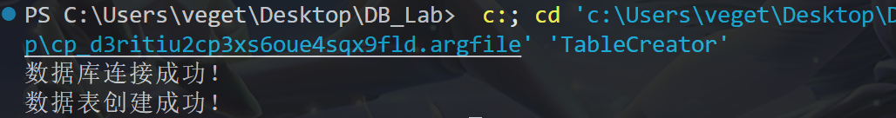
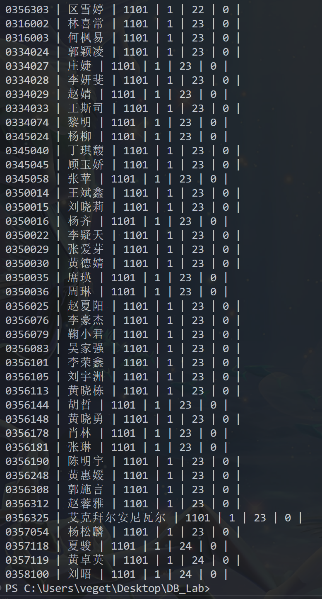
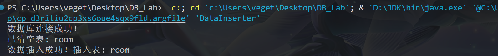
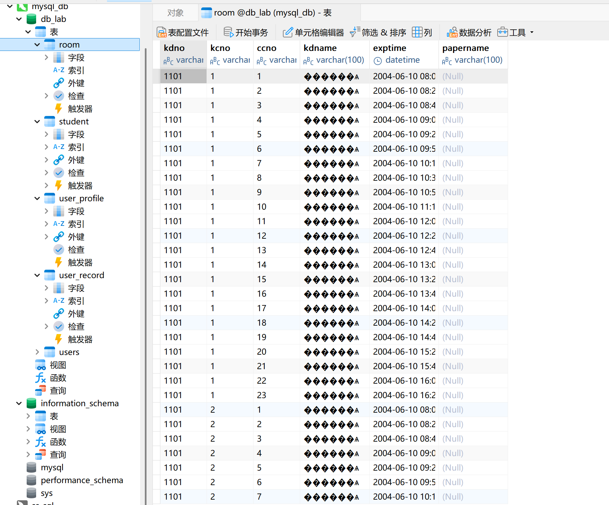
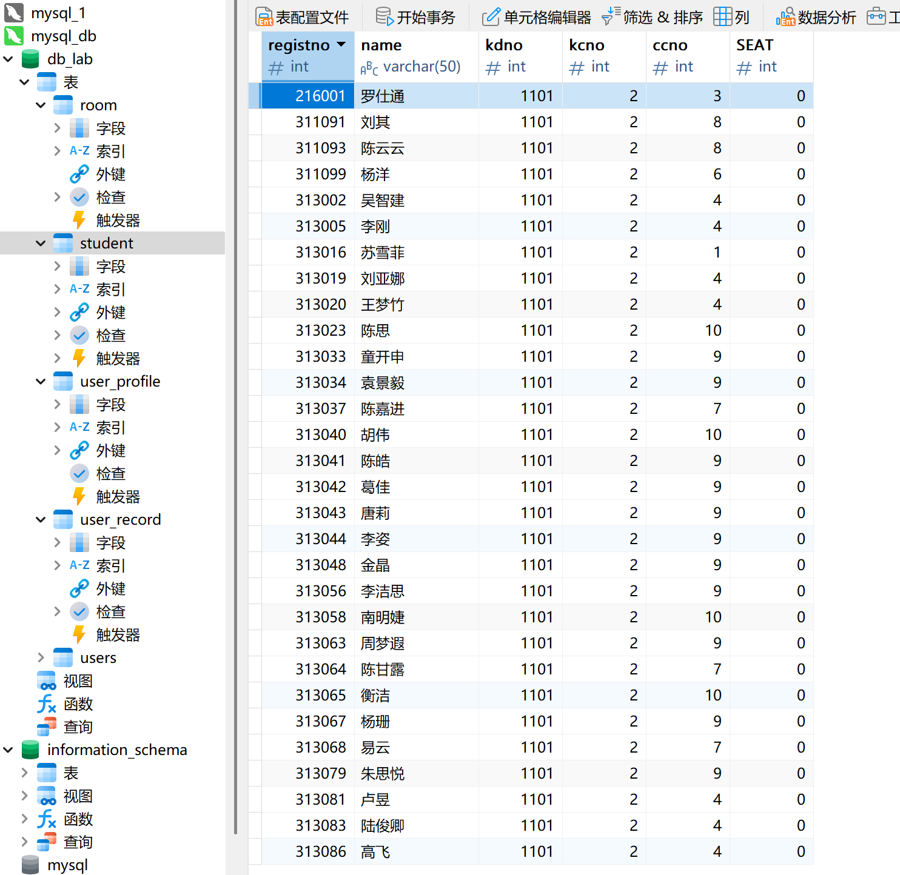

# 数据库应用接口实验报告
23307110043 孙天宇

## 一、实验目标
用自己熟悉的高级语言编写一个数据库初始化程序，将多种来源的外部数据导入MySql（或Oracle, SqlServer）

掌握高级语言操作数据库的方法，具体包括：
- 使用 Java 通过 JDBC 连接并操作 MySQL 数据库
- 实现外部数据（CSV格式）的读取和导入
- 掌握数据库表的动态创建和数据插入方法

## 二、实验环境
- 操作系统：Windows 10
- 数据库：MySQL 8.0
- 开发工具：VSCode
- 编程语言：Java（JDK 17）
- 数据库驱动：MySQL JDBC Driver (mysql-connector-j-9.2.0.jar)

## 三、实验步骤及实现

### 1. 数据库连接实现
使用 JDBC 实现了数据库连接类 `DatabaseConnector.java`：
```java
public class DatabaseConnector {
    private static final String URL = "jdbc:mysql://localhost:3306/db_lab";
    private static final String USER = "root";
    private static final String PASSWORD = "Tonysun050127";

    public static Connection connect() {
        try {
            Connection conn = DriverManager.getConnection(URL, USER, PASSWORD);
            System.out.println("数据库连接成功！");
            return conn;
        } catch (SQLException e) {
            System.out.println("数据库连接失败：" + e.getMessage());
            return null;
        }
    }
}
```

### 2. 数据表创建实现
实现了 `TableCreator.java` 类来动态创建数据表：
```java
public class TableCreator {
    public static void main(String[] args) {
        String[] createStatements = {
            "DROP TABLE IF EXISTS room" ,

            // 创建 student 表（保持不变）
            "CREATE TABLE IF NOT EXISTS student (" +
            "registno VARCHAR(20) PRIMARY KEY, " +
            "name VARCHAR(50), " +
            "kdno VARCHAR(10), " +
            "kcno VARCHAR(10), " +
            "ccno VARCHAR(10), " +
            "seat INT)",

            // 修正 room 表结构
            "CREATE TABLE IF NOT EXISTS room (" +
            "kdno VARCHAR(10), " +
            "kcno VARCHAR(10), " +
            "ccno VARCHAR(10), " +
            "kdname VARCHAR(100), " +
            "exptime DATETIME, " +  // 修改为 DATETIME 类型
            "papername VARCHAR(100))"
        };

        try (Connection conn = DatabaseConnector.connect();
             Statement stmt = conn.createStatement()) {
            
            for (String sql : createStatements) {
                stmt.executeUpdate(sql);
            }
            System.out.println("数据表创建成功！");
        } catch (Exception e) {
            e.printStackTrace();
        }
    }
}
```
- 可以同时完成创建两个表格

### 3. CSV 数据读取实现
创建了 `CSVReader.java` 类来读取 CSV 格式的数据：
```java
public class CSVReader {
    public static void main(String[] args) {
        String filePath = "student.csv"; // 可替换为 room.csv
        try (BufferedReader br = new BufferedReader(new FileReader(filePath))) {
            String line;
            // 读取标题行
            String header = br.readLine();
            System.out.println("Header: " + header);

            while ((line = br.readLine()) != null) {
                // 处理带引号的CSV字段
                String[] values = line.split(",(?=(?:[^\"]*\"[^\"]*\")*[^\"]*$)", -1);
                
                // 移除字段两侧的引号
                for (int i = 0; i < values.length; i++) {
                    values[i] = values[i].replaceAll("^\"|\"$", "");
                }

                // 动态打印所有列
                StringBuilder output = new StringBuilder();
                for (String value : values) {
                    output.append(value).append(" | ");
                }
                System.out.println(output.toString());
            }
        } catch (IOException e) {
            e.printStackTrace();
        }
    }
}
```

- 读取csv文件的操作，两个文件需修改局部代码分开进行


### 4. 数据导入实现
使用 `DataInserter.java` 类实现数据的导入：
```java
public class DataInserter {
    // 配置项
    private static final String TARGET_TABLE = "room"; // 可改为 student
    private static final String CSV_FILE = "room.csv"; // 可改为 student.csv
    
    public static void main(String[] args) {
        try (Connection conn = DatabaseConnector.connect();
             BufferedReader br = new BufferedReader(new FileReader(CSV_FILE))) {
            
            // 清空目标表
            truncateTable(conn, TARGET_TABLE);
            
            // 读取标题行确定字段数
            String[] headers = br.readLine().split(",(?=(?:[^\"]*\"[^\"]*\")*[^\"]*$)", -1);
            String sql = buildInsertSQL(TARGET_TABLE, headers.length);
            
            // 准备日期格式化器
            SimpleDateFormat[] dateFormats = {
                new SimpleDateFormat("yyyy-MM-dd H:mm"),
                new SimpleDateFormat("yyyy-MM-dd HH:mm")
            };

            Set<String> uniqueKeys = new HashSet<>();
            
            try (PreparedStatement pstmt = conn.prepareStatement(sql)) {
                String line;
                while ((line = br.readLine()) != null) {
                    String[] values = parseCSVLine(line, headers.length);
                    
                    // 处理主键去重（根据表结构调整）
                    String uniqueKey = TARGET_TABLE.equals("room") ? 
                        values[0] + values[1] + values[2] : // kdno+kcno+ccno
                        values[0]; // registno
                    if (!uniqueKeys.add(uniqueKey)) {
                        System.out.println("跳过重复记录: " + uniqueKey);
                        continue;
                    }
                    
                    // 绑定参数
                    for (int i = 0; i < headers.length; i++) {
                        setPreparedStatementValue(pstmt, i+1, headers[i], values[i], dateFormats);
                    }
                    pstmt.addBatch();
                }
                pstmt.executeBatch();
            }
            System.out.println("数据插入成功！插入表: " + TARGET_TABLE);
        } catch (Exception e) {
            e.printStackTrace();
        }
    }

    private static String[] parseCSVLine(String line, int expectedLength) {
        String[] values = line.split(",(?=(?:[^\"]*\"[^\"]*\")*[^\"]*$)", -1);
        for (int i = 0; i < values.length; i++) {
            values[i] = values[i].replaceAll("^\"|\"$", "").trim();
            if (values[i].isEmpty()) values[i] = null;
        }
        return values.length == expectedLength ? values : new String[expectedLength];
    }

    private static void setPreparedStatementValue(PreparedStatement pstmt, int index, 
            String columnName, String value, SimpleDateFormat[] dateFormats) throws SQLException {
        if (value == null) {
            pstmt.setNull(index, Types.VARCHAR);
            return;
        }


    }

    private static String buildInsertSQL(String tableName, int paramCount) {
        return "INSERT INTO " + tableName + " VALUES (" + 
            String.join(",", java.util.Collections.nCopies(paramCount, "?")) + ")";
    }

    private static void truncateTable(Connection conn, String tableName) throws SQLException {
        try (Statement stmt = conn.createStatement()) {
            stmt.executeUpdate("TRUNCATE TABLE " + tableName);
            System.out.println("已清空表: " + tableName);
        }
    }
}
```

- 插入两个csv文件的数据同样需要修改部分代码分开进行。这里注意了主键重复、日期格式等问题，保证room和student两个文件的信息均能正确导入到数据库中。

## 四、实验结果
1. 成功实现了数据库的连接

2. 成功创建了对应的数据表结构

3. 成功读取了 CSV 格式的数据文件

4. 成功将 CSV 数据导入到数据库中




## 五、思考
#### 关于外部数据不完整或不一致的处理方法：

1. **数据完整性处理**：
   - 设置默认值：对于缺失的非空字段，可以设置合理的默认值
   - 数据验证：在导入前进行数据验证，对不符合要求的数据进行标记或拒绝导入
   - 日志记录：记录所有异常数据，便于后续人工处理

2. **数据一致性处理**：
   - 外键检查：在导入数据前检查外键关系
   - 事务管理：使用数据库事务确保数据的一致性
   - 数据清洗：对原始数据进行预处理，确保符合数据库的约束条件

#### 处理原始数据的原则：
1. 数据验证优先：导入前进行数据格式和完整性验证
2. 异常处理完备：对所有可能的异常情况都要有处理措施
3. 日志记录详细：记录所有数据处理过程，便于追踪和调试
4. 事务管理严格：确保数据操作的原子性
5. 可回滚机制：在出现严重错误时能够回滚到操作前的状态

## 六、改进建议
1. 如何实现批量读取、导入数据（目前只能手工修改代码，一个一个文件分开操作）
2. 如何保证数据的安全性（例如密码应当加密后存入数据库）

