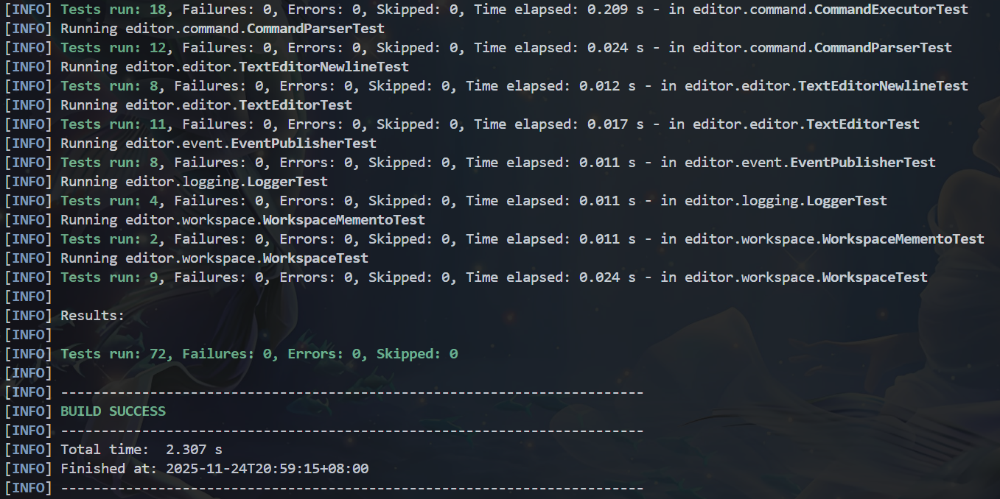

# Lab1 文本编辑器 架构设计文档
23307110043 孙天宇

## 1. 系统架构

### 1.1 模块划分图


```
┌─────────────────────────────────────────────────────────┐
│                      Main (主程序)                       │
└────────────────────┬────────────────────────────────────┘
                     │
        ┌────────────┴────────────┐
        │                         │
┌───────▼────────┐      ┌─────────▼──────────┐
│ CommandParser  │      │ CommandExecutor    │
│  (命令解析)     │──────│  (命令执行)        │
└────────────────┘      └─────────┬──────────┘
                                  │
                    ┌─────────────┴─────────────┐
                    │                           │
          ┌─────────▼──────────┐    ┌──────────▼──────────┐
          │    Workspace       │    │   EventPublisher    │
          │   (工作区管理)      │    │   (事件发布)        │
          └─────────┬──────────┘    └──────────┬──────────┘
                    │                           │
        ┌───────────┼───────────┐               │
        │           │           │               │
┌───────▼───┐  ┌────▼────┐  ┌───▼────────┐  ┌───▼──────┐
│  Editor   │  │ Logger  │  │Workspace  │  │EventListener│
│ (编辑器)  │  │ (日志)   │  │ Memento   │  │ (观察者)   │
└─────┬─────┘  └─────────┘  └───────────┘  └───────────┘
      │
┌─────▼────────┐
│ TextEditor  │
│ (文本编辑器) │
└─────┬───────┘
      │
┌─────▼──────────────┐
│ Command (命令模式)  │
│ - AppendCommand    │
│ - InsertCommand    │
│ - DeleteCommand    │
│ - ReplaceCommand   │
└────────────────────┘
```

### 1.2 模块职责说明

#### 1.2.1 主程序模块 (Main)
- **职责**: 程序入口，初始化工作区和命令执行器，处理用户输入循环
- **位置**: `editor.Main`

#### 1.2.2 命令解析模块 (CommandParser)
- **职责**: 解析用户输入的命令字符串，转换为结构化的命令对象
- **位置**: `editor.command.CommandParser`
- **功能**: 
  - 解析各种命令格式
  - 处理带引号的文本参数
  - 解析行号:列号格式
  - 验证命令格式

#### 1.2.3 命令执行模块 (CommandExecutor)
- **职责**: 执行解析后的命令，调用工作区和编辑器的方法
- **位置**: `editor.command.CommandExecutor`
- **功能**:
  - 执行18个命令
  - 处理用户交互（如保存确认）
  - 发布命令执行事件
  - 错误处理和提示

#### 1.2.4 工作区模块 (Workspace)
- **职责**: 管理多个编辑器实例，维护全局状态
- **位置**: `editor.workspace.Workspace`
- **功能**:
  - 管理打开的文件列表
  - 维护当前活动文件
  - 文件加载、保存、关闭
  - 日志管理
  - 工作区状态持久化

#### 1.2.5 编辑器模块 (Editor)
- **职责**: 提供文本编辑功能
- **位置**: `editor.editor.Editor` (接口), `editor.editor.TextEditor` (实现)
- **功能**:
  - 文本追加、插入、删除、替换
  - 内容显示
  - 撤销/重做功能
  - 修改状态管理

#### 1.2.6 命令模式模块 (Command)
- **职责**: 实现编辑操作的命令封装，支持撤销/重做
- **位置**: `editor.editor.command.*`
- **功能**:
  - 封装编辑操作为命令对象
  - 支持命令的撤销和重做
  - 维护命令历史栈

#### 1.2.7 日志模块 (Logger)
- **职责**: 记录命令执行历史
- **位置**: `editor.logging.Logger`
- **功能**:
  - 监听命令执行事件
  - 记录到日志文件
  - 自动启用日志（检测# log标记）
  - 日志查看功能

#### 1.2.8 事件模块 (Event)
- **职责**: 实现观察者模式，用于事件通知
- **位置**: `editor.event.*`
- **功能**:
  - 事件发布和订阅
  - 命令执行事件通知
  - 解耦命令执行和日志记录

#### 1.2.9 备忘录模块 (WorkspaceMemento)
- **职责**: 工作区状态的持久化和恢复
- **位置**: `editor.workspace.WorkspaceMemento`
- **功能**:
  - 保存工作区状态到文件
  - 从文件恢复工作区状态
  - 状态序列化和反序列化

### 1.3 模块依赖关系

```
Main
 ├─> CommandParser
 ├─> CommandExecutor
 │    ├─> Workspace
 │    │    ├─> Editor (TextEditor)
 │    │    ├─> Logger
 │    │    └─> WorkspaceMemento
 │    └─> EventPublisher
 │         └─> EventListener (Logger)
 │
TextEditor
 └─> Command (AppendCommand, InsertCommand, DeleteCommand, ReplaceCommand)

Logger
 └─> EventListener
```

**依赖说明**:
- Main 依赖 CommandParser 和 CommandExecutor
- CommandExecutor 依赖 Workspace 和 EventPublisher
- Workspace 管理 Editor、Logger 和 WorkspaceMemento
- TextEditor 使用 Command 模式实现撤销/重做
- Logger 实现 EventListener 接口，监听命令事件
- 所有模块都遵循依赖倒置原则，通过接口交互

## 2. 核心设计

### 2.1 设计模式应用

#### 2.1.1 命令模式 (Command Pattern)
- **应用位置**: `editor.editor.command` 包
- **目的**: 实现撤销/重做功能
- **实现**:
  - `Command` 接口定义 `execute()` 和 `undo()` 方法
  - 具体命令类：`AppendCommand`, `InsertCommand`, `DeleteCommand`, `ReplaceCommand`
  - `TextEditor` 维护撤销栈和重做栈
- **优势**: 
  - 将操作封装为对象，易于扩展
  - 支持操作的撤销和重做
  - 可以将命令序列化保存

#### 2.1.2 观察者模式 (Observer Pattern)
- **应用位置**: `editor.event` 包和 `editor.logging.Logger`
- **目的**: 实现命令执行事件的监听和日志记录
- **实现**:
  - `EventPublisher` 作为主题，管理监听器列表
  - `EventListener` 接口定义观察者
  - `Logger` 实现 `EventListener`，监听命令执行事件
  - `CommandExecutor` 发布命令执行事件
- **优势**:
  - 解耦命令执行和日志记录
  - 易于扩展其他监听器（如统计、审计等）
  - 支持一对多的通知机制

#### 2.1.3 备忘录模式 (Memento Pattern)
- **应用位置**: `editor.workspace.WorkspaceMemento` 和 `editor.workspace.WorkspaceState`
- **目的**: 实现工作区状态的持久化
- **实现**:
  - `WorkspaceState` 作为备忘录，保存工作区状态
  - `WorkspaceMemento` 负责状态的保存和恢复
  - 状态保存到 `.editor_workspace` 文件
- **优势**:
  - 封装状态保存逻辑
  - 支持状态的保存和恢复
  - 不暴露内部实现细节

### 2.2 其他设计相关说明

#### 2.2.1 接口抽象
- `Editor` 接口定义了编辑器的基本操作，便于未来扩展（如XML编辑器）
- `Command` 接口统一了命令的接口，便于扩展新的命令类型
- `EventListener` 接口支持多种类型的监听器

#### 2.2.2 依赖管理
- 所有模块通过接口交互，降低耦合
- 第三方库依赖隔离在测试模块（JUnit）
- 文件操作使用 Java NIO，提高性能和可移植性

#### 2.2.3 错误处理
- 使用异常处理机制，提供清晰的错误信息
- 日志记录失败不影响程序正常运行
- 边界条件检查（如行号、列号越界）

#### 2.2.4 数据存储
- 文本使用 `List<String>` 存储，每行一个元素
- 保存时用换行符 `\n` 连接
- 文件编码统一使用 UTF-8

## 3. 运行说明

### 3.1 使用的编程语言及版本
- **语言**: Java
- **版本**: Java 11 或更高版本
- **构建工具**: Maven 3.6+

### 3.2 安装依赖的步骤

1. 确保已安装 Java 11 或更高版本
   ```bash
   java -version
   ```

2. 确保已安装 Maven
   ```bash
   mvn -version
   ```

3. 在项目根目录执行以下命令安装依赖：
   ```bash
   mvn clean install
   ```

### 3.3 运行程序的命令

#### 3.3.1 方式1: 使用 Maven 运行
```bash
mvn exec:java -Dexec.mainClass="editor.Main"
```

#### 3.3.2 方式2: 编译后运行
```bash
# 编译
mvn compile

# 运行
java -cp target/classes editor.Main
```

#### 3.3.3 方式3: 打包后运行
```bash
# 打包
mvn package

# 运行
java -jar target/text-editor-1.0.0.jar
```

### 3.4 运行测试的命令

```bash
# 运行所有测试
mvn test

# 运行特定测试类
mvn test -Dtest=TextEditorTest

# 查看测试覆盖率（需要配置插件）
mvn test jacoco:report
```

## 4. 测试文档

### 4.1 测试用例列表

#### 4.1.1 编辑器模块测试 (TextEditorTest)
- `testAppend`: 测试追加文本功能
- `testInsert`: 测试插入文本功能
- `testInsertWithNewline`: 测试插入包含换行符的文本
- `testDelete`: 测试删除字符功能
- `testReplace`: 测试替换文本功能
- `testShow`: 测试显示内容功能
- `testLoad`: 测试加载文件内容
- `testUndoRedo`: 测试撤销/重做功能
- `testCommandPattern`: 测试命令模式
- `testInsertBoundary`: 测试插入操作的边界条件
- `testDeleteBoundary`: 测试删除操作的边界条件

#### 4.1.2 编辑器换行符测试 (TextEditorNewlineTest)
- `testInsertNewlineAtEnd`: 测试在行尾插入换行符
- `testInsertNewlineInMiddle`: 测试在行中插入换行符
- `testInsertMultipleNewlines`: 测试插入多个换行符
- `testInsertNewlineAtStart`: 测试在行首插入换行符
- `testInsertNewlineInEmptyFile`: 测试在空文件中插入换行符
- `testInsertNewlineOnly`: 测试只插入换行符
- `testInsertTextWithNewlineAtEnd`: 测试插入以换行符结尾的文本
- `testInsertNewlineWithEmptyParts`: 测试插入包含空行的换行符

#### 4.1.3 工作区模块测试 (WorkspaceTest)
- `testLoadFile`: 测试加载文件
- `testLoadNonExistentFile`: 测试加载不存在的文件
- `testInitFile`: 测试创建新缓冲区
- `testInitFileWithLog`: 测试创建带日志标记的缓冲区
- `testSetActiveFile`: 测试设置活动文件
- `testSaveFile`: 测试保存文件
- `testCloseFile`: 测试关闭文件
- `testFileList`: 测试获取文件列表
- `testAutoEnableLog`: 测试自动启用日志

#### 4.1.4 日志模块测试 (LoggerTest)
- `testEnableDisable`: 测试启用/禁用日志
- `testShouldAutoEnableLog`: 测试自动启用日志检测
- `testLogEvent`: 测试日志事件处理
- `testReadLog`: 测试读取日志内容

#### 4.1.5 命令解析模块测试 (CommandParserTest)
- `testParseLoad`: 测试解析load命令
- `testParseAppend`: 测试解析append命令
- `testParseInsert`: 测试解析insert命令
- `testParseDelete`: 测试解析delete命令
- `testParseReplace`: 测试解析replace命令
- `testParseShow`: 测试解析show命令
- `testParseInitWithLog`: 测试解析init with-log命令
- `testParseSaveAll`: 测试解析save all命令
- `testParseUnknownCommand`: 测试解析未知命令
- `testParseEmptyCommand`: 测试解析空命令
- `testParseEscapeSequences`: 测试解析转义序列（\n, \t, \\, \"）
- `testParseInsertWithNewline`: 测试解析包含换行符的insert命令

#### 4.1.6 工作区备忘录测试 (WorkspaceMementoTest)
- `testSaveAndLoad`: 测试保存和加载工作区状态
- `testLoadNonExistent`: 测试加载不存在的工作区文件

#### 4.1.7 命令执行模块测试 (CommandExecutorTest)
- `testExecuteLoad`: 测试执行load命令
- `testExecuteSave`: 测试执行save命令
- `testExecuteInit`: 测试执行init命令
- `testExecuteAppend`: 测试执行append命令
- `testExecuteInsert`: 测试执行insert命令
- `testExecuteDelete`: 测试执行delete命令
- `testExecuteReplace`: 测试执行replace命令
- `testExecuteShow`: 测试执行show命令
- `testExecuteUndoRedo`: 测试执行undo/redo命令
- `testExecuteLogOn`: 测试执行log-on命令
- `testExecuteLogOff`: 测试执行log-off命令
- `testExecuteLogShow`: 测试执行log-show命令
- `testExecuteEdit`: 测试执行edit命令
- `testExecuteEditorList`: 测试执行editor-list命令
- `testErrorHandling`: 测试错误处理
- `testExecuteUnknownCommand`: 测试未知命令处理

#### 4.1.8 事件模块测试 (EventPublisherTest)
- `testSubscribe`: 测试订阅事件
- `testUnsubscribe`: 测试取消订阅
- `testPublishEvent`: 测试发布事件
- `testMultipleListeners`: 测试多个监听器
- `testEventNotification`: 测试事件通知机制
- `testNoListeners`: 测试无监听器时的发布
- `testUnsubscribeNonExistent`: 测试取消不存在的订阅
- `testEventTimestamp`: 测试事件时间戳

### 4.2 测试执行结果

执行 `mvn test` 后，所有测试应该通过。测试覆盖了以下方面：

1. **功能测试**: 验证各个模块的基本功能
2. **边界测试**: 验证边界条件和异常处理
3. **集成测试**: 验证模块之间的协作
4. **设计模式测试**: 验证命令模式、观察者模式、备忘录模式的实现

测试结果：
```
[INFO] -------------------------------------------------------
[INFO]  T E S T S
[INFO] -------------------------------------------------------
[INFO] Running editor.command.CommandExecutorTest
[INFO] Tests run: 18, Failures: 0, Errors: 0, Skipped: 0
[INFO] Running editor.command.CommandParserTest
[INFO] Tests run: 12, Failures: 0, Errors: 0, Skipped: 0
[INFO] Running editor.editor.TextEditorNewlineTest
[INFO] Tests run: 8, Failures: 0, Errors: 0, Skipped: 0
[INFO] Running editor.editor.TextEditorTest
[INFO] Tests run: 11, Failures: 0, Errors: 0, Skipped: 0
[INFO] Running editor.event.EventPublisherTest
[INFO] Tests run: 8, Failures: 0, Errors: 0, Skipped: 0
[INFO] Running editor.logging.LoggerTest
[INFO] Tests run: 4, Failures: 0, Errors: 0, Skipped: 0
[INFO] Running editor.workspace.WorkspaceMementoTest
[INFO] Tests run: 2, Failures: 0, Errors: 0, Skipped: 0
[INFO] Running editor.workspace.WorkspaceTest
[INFO] Tests run: 9, Failures: 0, Errors: 0, Skipped: 0
[INFO] 
[INFO] Results:
[INFO] 
[INFO] Tests run: 72, Failures: 0, Errors: 0, Skipped: 0
[INFO] 
[INFO] ------------------------------------------------------------------------
[INFO] BUILD SUCCESS
[INFO] ------------------------------------------------------------------------
```


## 附录：命令使用示例

### A.1 基本操作
```bash
# 加载文件
> load test.txt

# 追加文本
> append "Hello World"

# 显示内容
> show

# 保存文件
> save

# 退出
> exit
```

### A.2 编辑操作
```bash
# 插入文本
> insert 1:6 " Beautiful"

# 删除字符
> delete 1:7 5

# 替换文本
> replace 1:1 5 "Hi"
```

### A.3 工作区管理
```bash
# 创建新缓冲区
> init new.txt with-log

# 切换活动文件
> edit test.txt

# 查看文件列表
> editor-list

# 显示目录树
> dir-tree
```

### A.4 日志功能
```bash
# 启用日志
> log-on

# 查看日志
> log-show

# 关闭日志
> log-off
```

